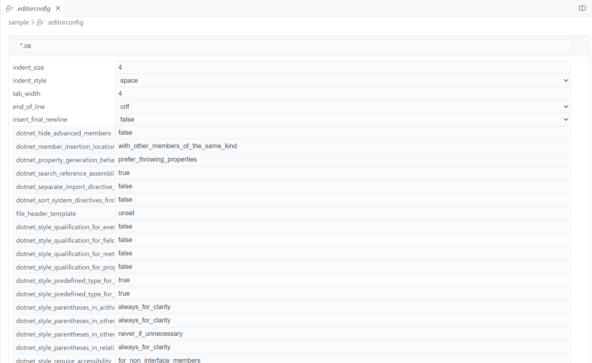

# EditorConfig Editor

A Visual Studio Code extension that provides a user-friendly, visual editor for `.editorconfig` files. Edit your EditorConfig settings with an intuitive interface instead of manually editing the file.



## Features

- 🎨 Visual editor for `.editorconfig` files
- ✨ Intuitive interface for managing sections and properties
- 📝 Support for all standard EditorConfig properties
- ➕ Add custom properties easily
- 🗂️ Manage multiple file patterns in separate sections
- 🔄 Real-time preview of changes

## Usage

1. Install the extension from the VS Code marketplace
2. Open any `.editorconfig` file in your workspace
3. The file will automatically open in the visual editor
4. Use the interface to:
   - Add new sections with file patterns
   - Add standard EditorConfig properties
   - Add custom properties
   - Edit values using dropdowns for predefined options
   - Delete properties or entire sections

### Configuration Options

Because this doesn't work well in 'diff' views, I recommend having this as your workspace or user settings:
```json
"workbench.editorAssociations": {
   "{git}:/**/*.{editorconfig}": "default",
   "*.editorconfig": "timheuer.econfigedit"
}
```
This will enable it to be default editor for times when not in git-diff modes.

## Supported Properties

The editor supports all standard EditorConfig properties:

- `indent_style` (space, tab)
- `indent_size` (number)
- `tab_width` (number)
- `end_of_line` (lf, cr, crlf)
- `charset` (utf-8, utf-8-bom, utf-16be, utf-16le, latin1)
- `trim_trailing_whitespace` (true, false)
- `insert_final_newline` (true, false)
- `max_line_length` (number)

You can also add custom properties as needed.

## Requirements

- Visual Studio Code version 1.99.0 or higher

## Contributing

This extension is open source! We welcome contributions on our [GitHub repository](https://github.com/timheuer/econfigedit).

## License

[MIT License](LICENSE.md)

## Issues and Feature Requests

Found a bug or have a feature request? Please file an issue on our [GitHub repository](https://github.com/timheuer/econfigedit/issues).
